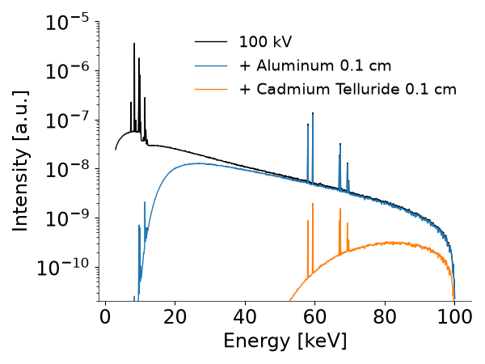
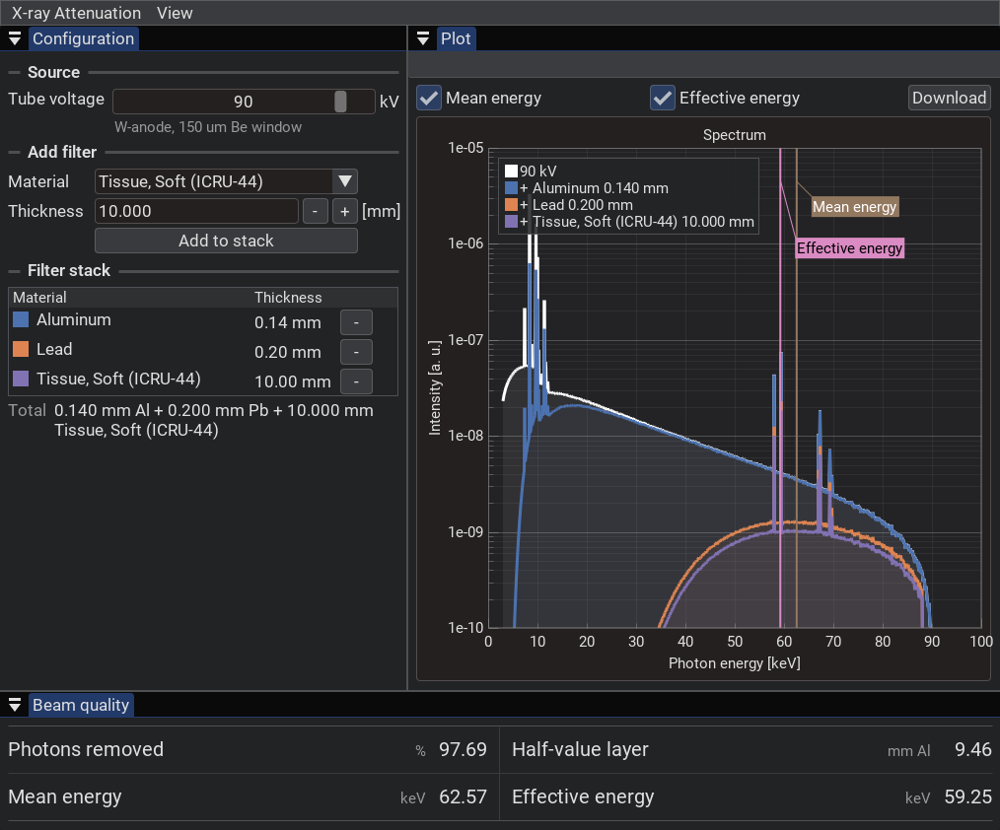

# X-Ray Attenuation
[](https://github.com/juseus03/X-Ray_Mass_Attenuation_DB/actions/workflows/python-package-conda.yml)
 [](LICENSE)

Software for computing photon transmission through matter, based on the NIST tables of X-ray mass attenuation coefficients [1].
 
The calculation is the Beer-Lambert law: the intensity $I$ of photons after traversing a thickness $t$ of material is
 
$$I = I_0 \exp(-\mu t)$$
 
where $I_0$ is the incident intensity and $\mu$ the linear attenuation coefficient of the material.
 
The software answers two questions:
1. What percentage of photons survives x cm of a material?
2. How much of a 9 kV - 100 kV tungsten spectrum survives x cm of a material?

## Installation
 
Requires Python >= 3.11. With conda and the `environment.yml`:
 
```bash
conda env create -f environment.yml -p ./envs
./envs/bin/pip install -e ".[dev]"
```
 
Or into an environment you already have:
 
```bash
pip install -e .
```
 
Both add the `xray-attenuation` and `xray-attenuation-gui` commands to your PATH. The `[dev]` extra adds `pytest` and `ruff`.
 
## Usage
### CLI
 
The CLI works in two ways. For a single energy, material, and thickness:
 
```bash
xray-attenuation # Prompts for material, thickness, and energy
# or
xray-attenuation -m Al -t 0.1 -e 30 # 1 mm Al at 30 keV
```
 
which prints:
 
```
For 0.1 cm of 'Aluminum' the transmission of photons, with energy 30.0 keV, is around 73.52 %
```
 
Material names with spaces or commas have to be quoted:
 
```bash
xray-attenuation -m "Cadmium Telluride" -t 0.05 -e 60
```
```
For 0.05 cm of 'Cadmium Telluride' the transmission of photons, with energy 60.0 keV, is around 13.17 %
```
 
To plot the transmission of a 100 kV tungsten X-ray spectrum through 1 mm Al and 1 mm CdTe:
 
```bash
xray-attenuation -f -m Al "Cadmium Telluride" -t 0.1 -e 100
```
 
Filters stack, so this plots three curves: the bare 100 kV spectrum, the spectrum after 1 mm Al, and the spectrum after 1 mm Al plus 1 mm CdTe.
 
`-s` / `--save-plot` also writes the figure as a .png in the OS designated temporal folder (`/tmp/` for Linux).
 

 
#### Options
 
| Option | Meaning |
| --- | --- |
| `-m`, `--material_name` | Element symbol (`Al`), element name (`Aluminum`), or compound name. Takes several values in full-spectrum mode. Use `-` to browse the material list interactively. |
| `-t`, `--thickness` | Thickness in cm. Takes several values in full-spectrum mode. |
| `-e`, `--energy` | Photon energy in keV (3 - 200), or the tube voltage in kV (9 - 100) in full-spectrum mode. |
| `-f`, `--full-spectrum` | Filter a whole tungsten spectrum instead of a single energy, and plot the result. |
| `-s`, `--save-plot` | Write the plot as a .png. Full-spectrum mode only. |
 
In single-value mode, any argument you leave out is prompted for. Full-spectrum mode prompts only for the energy.
 
Equal-length material and thickness lists are paired one to one (`-m Al Cu -t 0.1 0.2` gives Al 1 mm followed by Cu 2 mm). Otherwise every material is combined with every thickness.
 
### GUI
This starts the interactive GUI, built with Dear ImGui Bundle [2]:
 
```bash
xray-attenuation-gui
```

 
**Note:** the *Download* button opens a native file dialog. On Linux the dialog may not appear at all, which means `zenity` or `kdialog` is not installed.
 
## Other information
### List of materials
 
All 92 elements, from Z = 1 (Hydrogen) to Z = 92 (Uranium), by symbol (`Al`) or full name (`Aluminum`), plus 17 compounds:
 
| Material | Density [g/cm³] |
| --- | --- |
| Adipose Tissue (ICRU-44) | 0.95 |
| Air, Dry (near sea level) | 0.001205 |
| Blood, Whole (ICRU-44) | 1.06 |
| Bone, Cortical (ICRU-44) | 1.92 |
| Brain, Grey/White Matter (ICRU-44) | 1.04 |
| Breast Tissue (ICRU-44) | 1.02 |
| Cadmium Telluride | 6.2 |
| Gallium Arsenide | 5.31 |
| Glass, Borosilicate (Pyrex) | 2.23 |
| Muscle, Skeletal (ICRU-44) | 1.05 |
| Polyethylene Terephthalate, (Mylar) | 1.38 |
| Polymethyl Methacrylate, (PMMA) | 1.19 |
| Polytetrafluoroethylene, (Teflon) | 2.25 |
| Polyvinyl Chloride, (PVC) | 1.406 |
| Tissue, Soft (ICRU-44) | 1.06 |
| Water, Liquid | 1.0 |
| PLA, (XCOM) | 1.108 |
 
Running `xray-attenuation -m -` lists every element and compound with an index you can select instead of typing the name.
 
### NIST tables
The files in `data/` are derived from the NIST database [1] and are not kept in sync with it. They hold the linear attenuation coefficient $\mu$ in $1/cm$, not the $\mu/\rho$ that NIST publishes.
 
### Tungsten spectra
The 9, 10, 15, 20, 25, 30, 40, 50, 60, 70, 80, 90, and 100 kV spectra come from a Geant4 simulation of an X-ray source with a tungsten anode, modelled on the Hamamatsu L10101. Everything in between is linearly interpolated.
 
The spectra are not all the same length, so shorter ones are padded with `1e-35` to mark "no data". The same value is the floor when filtering: anything below it is set to zero, so it disappears cleanly from the logarithmic plots.
 
## References
[1] Hubbell, J.H. and Seltzer, S.M. (2004), Tables of X-Ray Mass Attenuation Coefficients and Mass Energy-Absorption Coefficients (version 1.4). [Online] Available: http://physics.nist.gov/xaamdi [2024, 03 28]. National Institute of Standards and Technology, Gaithersburg, MD.

[2] https://imgui-bundle.pages.dev/
 
## License
 
MIT, see [LICENSE](LICENSE). Copyright (c) 2024 Juan Sebastián Useche.
